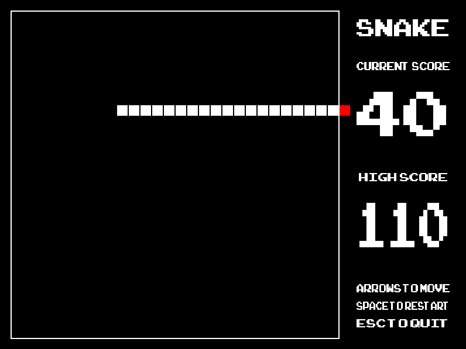

# S(DL2)nake
[](https://travis-ci.com/camjw/SnakeSnakeSnaaaaaaake)

A version of the classic snake game build in C++ using the SDL2 libraries.



## Technologies

C++, GoogleTest, GoogleMock, SDL2.

## Installation instructions

To install snake on your machine first clone the repo

```
git clone https://github.com/camjw/S-DL2-nake.git
```

then install the dependencies using the `configure.sh` file:

```
bash configure.sh
```

This script uses HomeBrew to install the SDL2 dependencies and also installs GoogleTest and GoogleMock on your machine.

Note that this project is only supported on OSX. If you're running on Windows or Linux you will need to install these dependencies manually.

Finally, install the game by running `make && make install` from the root of the repo. You can then launch the game from any terminal by entering `snake`!

## Testing

The tests are written using GoogleTest. There are 16 unit tests which cover the majority of the public API. These must first be compiled by running

```
make test
```

and then can be executed by running `./test`. In the `lib` folder, there is a subfolder called `mock` which contains mocks of all classes except `Game`. All dependencies are fully injected throughout the tests.

## Contributing

The game is mostly finished, though I would like to improve the text rendering. At the moment test rendering is done in the Background class through the `renderText` method:

```c++
void Background::renderText(const char* text, int x, int y, int w, int h) {
  TTF_Font* renderedFont;
  SDL_Surface* renderedSurface = TTF_RenderText_Solid(gameFont, text, White);
  SDL_Texture* renderedTexture = SDL_CreateTextureFromSurface(_renderer, renderedSurface);
  SDL_Rect renderedRect { x, y, w, h };
  SDL_RenderCopy(_renderer, renderedTexture, NULL, &renderedRect);
}
```

This requires `x, y` co-ordinates for the top right of the rectangle rendering the text. I would much prefer it to take the current `y` coord and the `x` coord of the centre line through the rectangle so that text can be rendered centrally rather than left aligned. I'd also like the dimensions of the bod to be dependent on the number of characters so that text is all the same font size.

I would be really happy to receive a PR on this or any other matter.

## License

This repo is MIT licensed.

## Acknowledgements

I learned a lot about SDL2 from LazyFoo, their tutorials can be found [here](http://lazyfoo.net/). I also got the sounds used in this game from SoundBible which can be found [here](http://soundbible.com).
